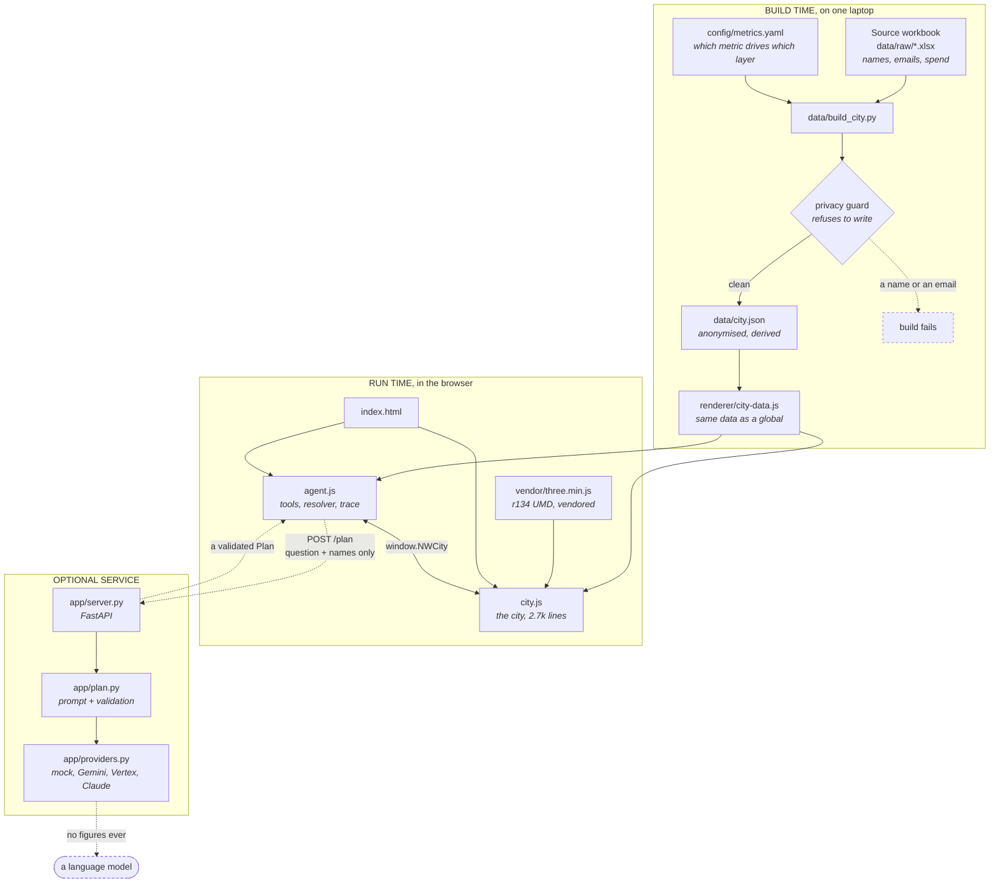
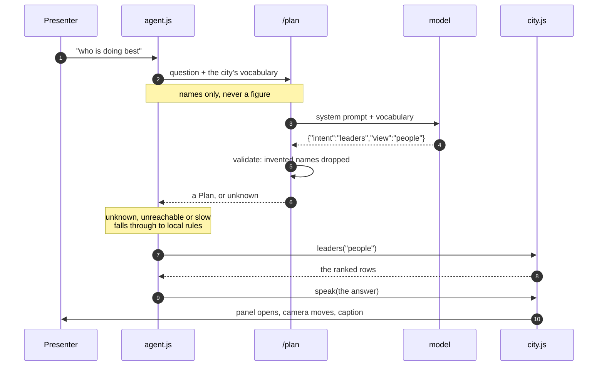
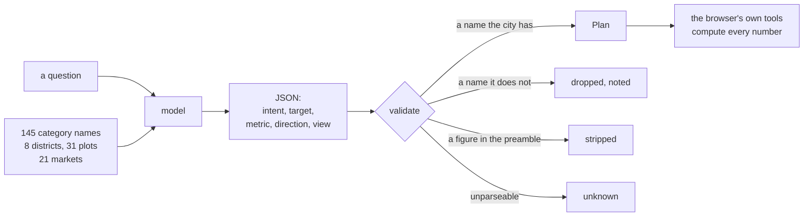
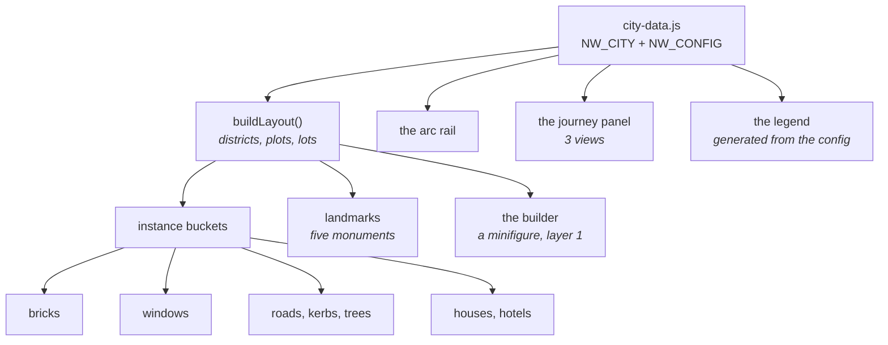
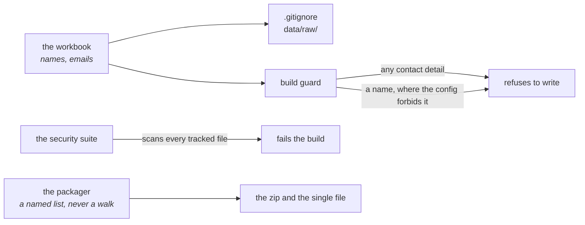
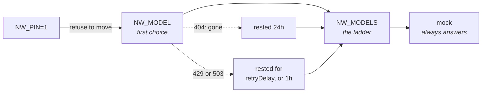
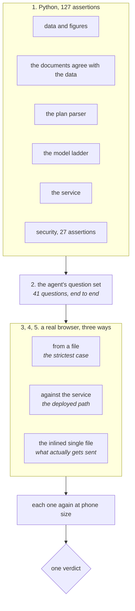
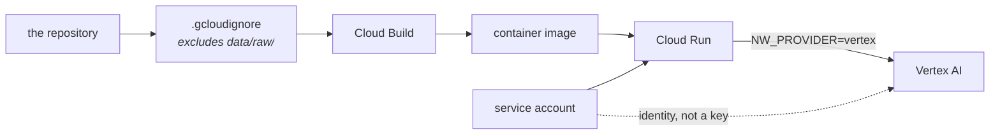

# Architecture

How the parts fit, what depends on what, and which decisions are load-bearing.
For why each choice was made rather than what it is, see
[DESIGN.md](DESIGN.md).

## The whole thing at a glance



The dashed edges are the ones that are allowed to fail. Everything solid works
with no network, no key and no Python.

## Three things that can run, and what each needs

| What | Needs | Gets you |
| --- | --- | --- |
| `renderer/index.html` from disk | a browser | the whole city, the agent on its own rules |
| **`NW Digital City.html`** | a browser | the same, as one file you can email |
| `run.py serve` | Python, optionally a key | the same, plus a model doing the routing |

This ordering is deliberate. The thing that matters is on screen in front of
400 people, so the version with the fewest moving parts has to be complete on
its own. The model improves how loosely a question can be phrased. It is not
load-bearing.

## The question path

Every question goes down the same path, and the path is designed so that any
step can fall over without the previous ones caring.



**The fallback is not an error path, it is the default path.** Opened from a
file there is no service to ask, so the regex rules in `agent.js` do the
routing every time. The browser suite drives both, because two sets of rules
answering one question differently is a failure nobody notices until it is
live.

## What the model is allowed to decide

The model chooses an intent and, where a question names somewhere, a target.
It does not compute, phrase or see anything else.



Three rules make this safe rather than merely tidy:

1. **No figures go up.** The prompt carries names only. No spend figure, no
   score, no count leaves the laptop. It also cannot state a number, because it
   has none to state.
2. **No figures come down.** A preamble containing a digit is discarded. Every
   number on screen is computed in the browser from `city.json`.
3. **No invented targets.** A category the city does not have is dropped rather
   than passed through, so the camera cannot fly nowhere and print a code that
   does not exist.

## The agent's tools

`agent.js` holds eight functions. These are the whole of what a question can
cause to happen, and each call is logged to the visible trace panel so the room
can see the reasoning rather than take it on trust.

| Tool | What it does |
| --- | --- |
| `find_category` | resolve a code, a name, a district, a plot, a market or a definition |
| `get_metrics` | every measure held for one category |
| `measure` | the value a ranking sorts on, including the journey score |
| `rank` | categories in a scope, ordered by a metric |
| `leaders` | open the leaderboard on one of its three views, return the rows |
| `find_gaps` | lots with money on them and nothing built |
| `summarise` | built, empty and spend for a scope |
| `render` | drive the city: fly, focus, dim, raise, speak |

`render` is the important one. **The visualisation is the agent's output
surface.** It answers by changing what you are looking at, not by describing
what it would change.

## The renderer



Two things here are worth knowing before reading the code:

**Everything is `InstancedMesh`.** One draw call per shape, so 145 buildings of
up to sixteen storeys stay at a steady frame rate on a laptop with no discrete
graphics. Building a category rewrites instance matrices on a wall-clock
timeline rather than adding objects.

**The builder is drawn in a second pass on camera layer 1**, after
`renderer.clearDepth()`, so a minifigure standing behind a tower is still
visible. The sky is `renderer.setClearColor()` rather than `scene.background`
for the same reason.

**The legend is generated from `config/metrics.yaml`.** Change which metric
drives a layer and the on-screen explanation follows, so the explanation cannot
drift from what is drawn.

## Configuration is the pivot point

```yaml
layers:
  height:
    metric: market_reach     # swap to ava_adoption, cbp_total, spend_eur
```

`city.json` carries *every* candidate metric for every category, so changing
the business lens is an edit to one line. No rebuild, no code change. Tests
fail if a layer points at a metric the data does not carry, and a separate test
refuses any metric the registry marks as not-real from driving anything
visible.

The same file declares the score weights, the spend bands, the landmark rules,
the minimum categories for the leaderboard, and whether people are shown by
name, by initials or not at all.

## Privacy, as enforced rather than intended



Four independent mechanisms, because one is a promise and four is a property:

- **`data/raw/` is git-ignored.** The workbook never becomes a tracked file.
- **The build refuses to write** if it finds an email or a contact detail at
  any setting, or a name at a setting that does not permit one.
- **The packager builds from a named list**, never a directory walk, because a
  directory walk is how a workbook ends up in a distributable.
- **The security suite scans every tracked file** for credentials, contact
  details and the workbook itself, on every run of `run.py test`.

Category manager names are published, and only because
`config/metrics.yaml` says `people: show: names`. Setting it to `initials` or
`none` and rebuilding is the whole change.

## The model ladder

A single model name in a config file is a single point of failure on the day,
so `NW_MODEL` is a first choice rather than an instruction.



A model that returns 404 is rested for a day; one that rate-limits is rested
for whatever it asks for, or an hour. The answer reports which model actually
replied, not which one was configured, because a result you cannot attribute to
a model is not much of a result.

## Testing topology



Ordered cheapest first, so a broken build is reported in under a second rather
than after two minutes of browser work. `run.py test` is the whole thing.

Stage 5 exists because inlining is a text substitution and text substitutions
go wrong quietly: a broken single file looks exactly like a working one until
somebody opens it, and by then it is in their inbox.

## Deployment



On Cloud Run the credential is a service account rather than an API key, so
nothing secret is in the image or the environment. The deploy script refuses to
upload without a committed `.gcloudignore`, because Cloud Build uploads a
folder and the workbook lives in one.

## What each file is for

```
run.py                    the only command anyone needs
config/metrics.yaml       which metric drives which visual layer
data/build_city.py        workbook to anonymised city.json
data/city.json            the only data the renderer needs
renderer/index.html       the shell, the panels, the styles
renderer/city.js          the city, the builder, the choreography
renderer/agent.js         the tools, the resolver, the visible trace
renderer/city-data.js     city.json as a global, because file:// blocks fetch
renderer/vendor/          three.js r134 UMD, vendored on purpose
app/server.py             serves the page and holds the credential
app/plan.py               what the model may decide, and the validation
app/providers.py          mock, Gemini, Vertex, Claude behind one interface
app/models.py             asks a provider what it actually has
app/eval.py               the question set, run end to end
app/env.py                reads .env without a dependency
tests/test_docs.py        every figure the documents quote
tests/test_security.py    secrets, personal data, what gets distributed
tests/smoke.js            a real browser, desktop and phone
deploy/cloudrun.sh        Cloud Run with a service account, no key
```

## Decisions that are hard to reverse

Worth knowing before changing anything.

**three.js r134 UMD, vendored.** `file://` blocks ES modules and `fetch()`, so
a module build and a CDN are both unavailable. This is why data ships as a
script assigning a global rather than as JSON.

**`city.json` carries every candidate metric, not just the bound ones.**
It is what makes the config a pivot point rather than a comment.

**The renderer has no runtime dependency on the service.** Any feature that
only works when the service is up is a feature that will not work on stage.

**The score is computed in two places.** Python for the build, JavaScript for
the panel roll-up, with the same sqrt-of-spend weighting. A single test asserts
they agree, because two implementations of one formula is a real risk and the
alternative was shipping pre-computed rollups for combinations nobody asked for
yet.
