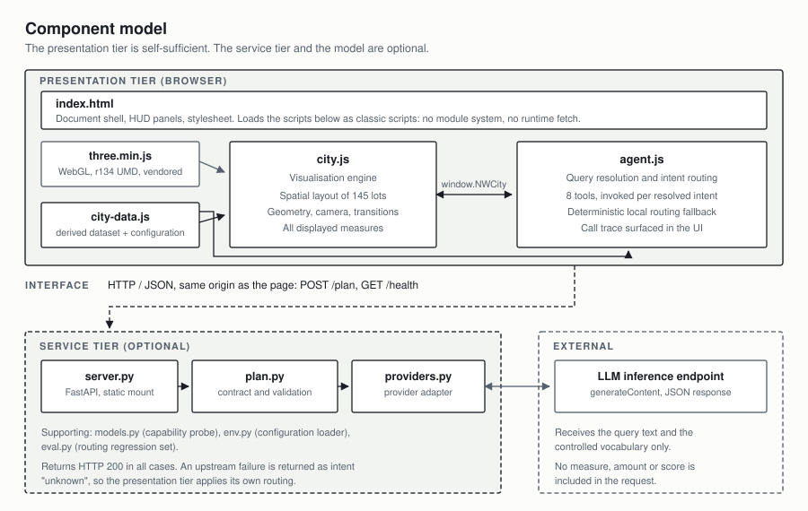
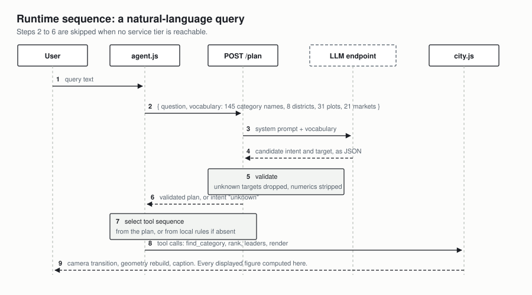
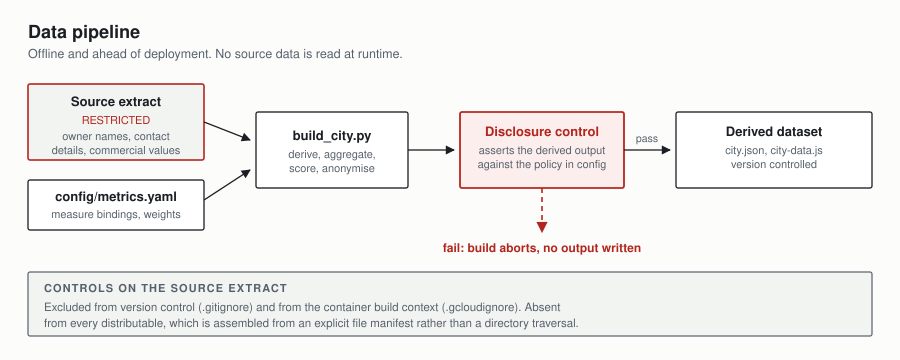
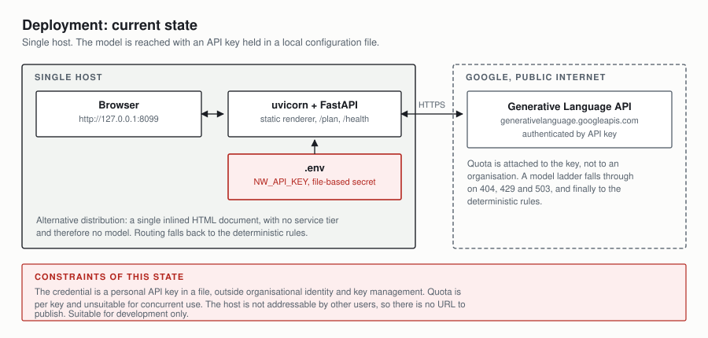
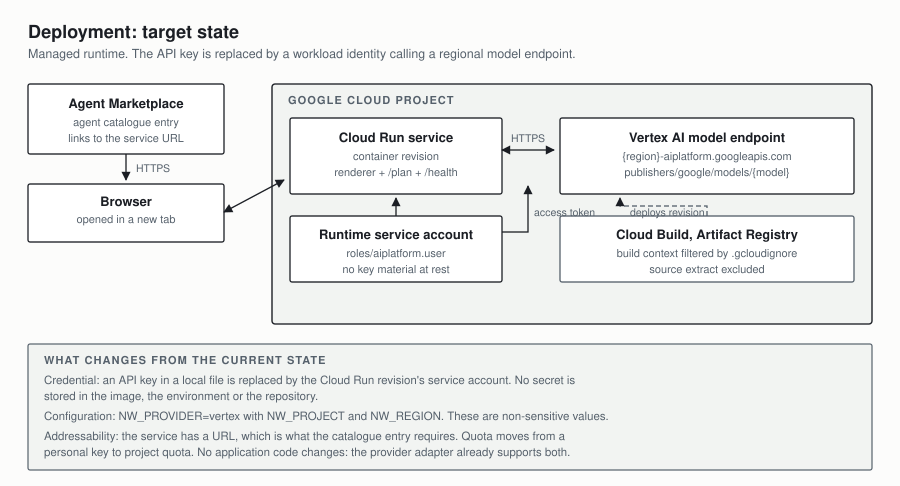

# Architecture

## 1. Purpose and scope

NW Digital City renders the Networks category blueprint estate as an
interactive three-dimensional model: 8 level-2 areas, 31 level-3 groups and
145 level-4 categories, each carrying its blueprint status, market reach,
sourcing spend, AI-generated RFP count and blueprint usage.

This document describes the component structure, the interfaces between
components, the runtime interactions, the data pipeline, the security controls
and the deployment topology in both its current and target states.

Measure definitions are in [JOURNEY-SCORE.md](JOURNEY-SCORE.md). Operational
procedures are in [DEPLOY.md](DEPLOY.md), [GCP-SETUP.md](GCP-SETUP.md) and
[TESTING.md](TESTING.md).

## 2. Architectural drivers

| Driver | Consequence |
| --- | --- |
| The visualisation must function without network access | The dataset is embedded in the delivered page. No runtime data retrieval. |
| The visualisation must function without a package manager or module loader | Classic scripts and a vendored 3D library. No ES modules, no CDN. |
| No commercially sensitive value may be sent to an external inference service | The model receives a controlled vocabulary of identifiers only. |
| No personal data may reach version control or any distributable | A disclosure control gates the build; the source extract is excluded from both. |
| The natural-language interface must not be a single point of failure | Deterministic local routing is the default path, not an error path. |
| Business measure bindings must be changeable without code changes | Declarative configuration drives the visual encoding, legend and scoring. |

## 3. Component model



| Component | Responsibility |
| --- | --- |
| `renderer/index.html` | Document shell, HUD panels, stylesheet. Loads the scripts below as classic scripts. |
| `renderer/city-data.js` | The derived dataset and the effective configuration, assigned to globals. |
| `renderer/city.js` | Visualisation engine: spatial layout, geometry, camera, transitions, and computation of every displayed measure. |
| `renderer/agent.js` | Query resolution, intent routing, the eight tools, and the call trace. |
| `renderer/vendor/three.min.js` | WebGL abstraction, r134 UMD, vendored. |
| `app/server.py` | HTTP API and static mount. |
| `app/plan.py` | The decision contract and its validation. |
| `app/providers.py` | Provider adapter over mock, Generative Language API, Vertex AI and Anthropic. |
| `app/models.py` | Capability probe against the configured provider. |
| `app/env.py` | Configuration loader. |
| `data/build_city.py` | Derivation, aggregation, scoring, anonymisation and the disclosure control. |
| `config/metrics.yaml` | Declarative measure registry, visual bindings, scoring weights and disclosure policy. |

### 3.1 Interfaces

| Interface | Protocol | Contract |
| --- | --- | --- |
| `window.NWCity` | In-process JavaScript | 20 operations. Acting on the city: `focus`, `focusDistrict`, `showJourney`, `command`, `night`, `potential`, `asks`, `rise`, `reset`, `setLayerMetric`. Reading it without changing it: `data`, `config`, `layout`, `state`, `pending`, `score`, `monuments`, `monumentLight`, `monumentShapes`, `plate` |
| `POST /plan` | HTTP, JSON | Request: query text and controlled vocabulary. Response: a validated decision object. Always HTTP 200. |
| `GET /health` | HTTP, JSON | Configured provider, readiness, and diagnostic detail. |
| Inference call | HTTPS, JSON | `generateContent` with a system instruction, the query and a JSON response schema. |

The presentation tier has no build step and no runtime dependency on the
service tier. `POST /plan` is called against the page's own origin, so no
cross-origin configuration is required.

## 4. Runtime views

### 4.1 Natural-language query



The inference call influences routing only. Every value rendered or stated is
computed in the presentation tier from the embedded dataset.

### 4.2 Routing modes

| Mode | Condition | Router |
| --- | --- | --- |
| Service-routed | Service tier reachable and returning a usable decision | The inference endpoint, subject to validation |
| Locally routed | No service tier present, as when the document is opened directly | Deterministic pattern rules in `agent.js` |
| Degraded | Service tier present but slow, unreachable or returning an unusable decision | The same deterministic rules |

Both routers resolve to the same tool sequence for the same query. The
equivalence is asserted by the browser test suite, which exercises both modes.

### 4.3 Decision contract

The inference response is constrained to one object and validated before use.

```json
{"intent": "leaders", "target": {"kind": "none", "value": ""},
 "metric": "journey", "direction": "desc", "view": "people", "preamble": ""}
```

| Field | Domain |
| --- | --- |
| `intent` | one of 11 enumerated values |
| `target.kind` | `category`, `district`, `plot`, `market`, `none` |
| `target.value` | must resolve against the supplied vocabulary |
| `metric` | `journey`, `market_reach`, `spend_eur`, `cbp_total` |
| `direction` | `asc`, `desc` |
| `view` | `people`, `districts`, `categories` |
| `preamble` | free text, rejected if it contains any digit |

Validation applies three rules:

1. A target that does not appear in the supplied vocabulary is discarded and
   the discard is recorded in the response.
2. A value outside an enumerated domain falls back to that field's default.
3. Free text containing a numeric character is discarded, so no figure can be
   asserted by the inference service.

### 4.4 Tool inventory

| Tool | Function |
| --- | --- |
| `find_category` | Resolve an identifier, title, level-2 area, level-3 group, market or descriptive phrase |
| `get_metrics` | All measures held against one category |
| `measure` | The value a ranking sorts on, including the composite score |
| `rank` | Categories within a scope, ordered by a measure |
| `leaders` | Open the scoreboard on a named view and return its rows |
| `find_gaps` | Categories carrying spend with no blueprint |
| `summarise` | Coverage and spend aggregates for a scope |
| `render` | Apply a state change to the visualisation |

Each invocation is written to a trace panel in the interface, so the resolution
path for any query is observable.

## 5. Data architecture

### 5.1 Pipeline



The pipeline is executed offline and ahead of deployment. `data/city.json` and
`renderer/city-data.js` are generated artefacts held under version control; the
build is deterministic given the same source extract and configuration.

### 5.2 Data classification

| Artefact | Classification | Controls |
| --- | --- | --- |
| Source extract (`data/raw/`) | Restricted: owner names, contact details, commercial values | Excluded from version control and from the container build context. Absent from every distributable. |
| Derived dataset (`data/city.json`, `renderer/city-data.js`) | Internal | No contact details at any configuration setting. Category owner names present only where the disclosure policy permits. |
| Distributables (archive, single-document build) | Internal | Assembled from an explicit file manifest, never a directory traversal. |

### 5.3 Derived dataset structure

```
meta        provenance, scope, disclosure declarations, market list, counts
totals      organisation-level coverage, spend and composite score
districts[] level-2 areas, each with its level-3 groups and aggregates
categories[] 145 records: identifier, title, parentage, markets, owners,
             measures, composite score components, landmark assignment
```

Every candidate measure is carried for every category, whether or not it is
currently bound to a visual encoding. This is what allows the visual encoding
to be changed by configuration alone.

## 6. Configuration model

`config/metrics.yaml` is the single point of change for business semantics.

| Block | Governs |
| --- | --- |
| `layers` | Which measure drives each visual encoding |
| `metrics` | The measure registry: units, tier thresholds, provenance flags |
| `score` | Composite score weights, component thresholds, stage boundaries, roll-up method, eligibility floor |
| `people` | Whether category owners are identified by name, by initials, or not at all |
| `landmarks` | Journey-score threshold, legend copy, and per-market assignment |
| `street_life` | The district-level measure behind the traffic, the pedestrians and the lane markings, with the counts, the standing share, the placement bias and the four-lane threshold |
| `props` | Which prop marks which blueprint state, with the label and caption each carries in the legend. A crane on a drafted lot, a to let board on an active lot nobody has used, a sleeper on a plot with neither. `crane.base` sizes the wheeled carrier under the mast; `sleeper.rise` sets how many marks climb over a sleeper, how far, how fast and how far they lean |
| `explainer` | The framing and the caveats behind the in-app explanation. Everything else on that page is generated from the blocks above it |
| `disclosure` | Whether provisional and placeholder measures are annotated in the interface. No layer currently rests on either, and a test asserts that a layer cannot rest on one with its badge switched off |

Changing a visual binding is a one-line edit:

```yaml
layers:
  height:
    metric: market_reach     # alternatives: ava_adoption, cbp_total, spend_eur
```

The interface legend is generated from this file, so the on-screen explanation
cannot diverge from the encoding in use. The test suite fails if a binding
names a measure the dataset does not carry, or if a measure flagged as
placeholder is bound to any visual encoding.

## 7. Security controls

| Control | Implementation | Verified by |
| --- | --- | --- |
| No credential in version control | `.env` is git-ignored; `.env.example` carries placeholders | Secret pattern scan across all tracked files |
| No credential in the container image | Configuration supplied at deploy time; target state uses workload identity | Image and deploy script inspection |
| No credential reachable from the browser | The credential is held in the service tier; the page calls its own origin | Assertion that no credential identifier appears in presentation-tier sources |
| No personal data in generated output | Disclosure control gates the build | Assertions over the generated dataset at every policy setting |
| Source extract excluded from distribution | `.gitignore`, `.gcloudignore`, explicit packaging manifest | Archive contents and ignore-file assertions |
| No commercial value sent to inference | Prompt construction carries identifiers only | Prompt construction assertions |
| No dynamic code evaluation in the presentation tier | No `eval`, no `Function` constructor | Source scan |
| User input is not interpreted as markup | Query text reaches the DOM as text | Source scan |
| Framing refused unless an origin is declared | Response headers | Header assertions |
| Inference failure cannot fail the request | The endpoint returns HTTP 200 with intent `unknown` | Fault-injection assertions |

## 8. Deployment

### 8.1 Current state



A single host runs the service tier and serves the presentation tier. The
inference credential is an API key held in a local configuration file. Quota is
attached to the key rather than to an organisation, and the host is not
addressable by other users. This topology is suitable for development only.

A model ladder mitigates individual model unavailability: `NW_MODEL` is a first
preference, `NW_MODELS` an ordered fallback list, and `NW_PIN=1` disables
fallback. A model returning HTTP 404 is withdrawn for 24 hours; one returning
429 or 503 is withdrawn for the interval it requests, or one hour. The response
reports the model that answered rather than the one configured.

### 8.2 Target state



The service is deployed as a Cloud Run revision built by Cloud Build from a
filtered build context. Inference moves to a regional Vertex AI model endpoint,
authenticated by the revision's runtime service account through application
default credentials. No key material is held at rest.

The agent catalogue entry links to the service URL and opens it in a new
browser context. The service is not embedded, so no framing exemption is
required.

### 8.3 Migration

| Step | Change |
| --- | --- |
| 1 | Provision a project with the Vertex AI API enabled |
| 2 | Create the runtime service account and grant `roles/aiplatform.user` |
| 3 | Deploy with `NW_PROVIDER=vertex`, `NW_PROJECT` and `NW_REGION` |
| 4 | Remove `NW_API_KEY` from the deployed configuration |
| 5 | Register the service URL as the catalogue entry target |

No application change is required: the provider adapter already implements both
authentication modes, and the switch is configuration only. The single-document
build remains available as an offline distribution independent of either
topology.

## 9. Verification

`run.py test` executes five stages, ordered by cost, and reports a single
verdict.

| Stage | Scope |
| --- | --- |
| 1 | Dataset integrity, documented figures, decision contract, model ladder, service behaviour, security controls |
| 2 | Routing regression set, executed end to end against the configured provider |
| 3 | Presentation tier in a browser, loaded directly, at desktop and handset viewports |
| 4 | Presentation tier in a browser, served by the service tier, at both viewports |
| 5 | The single-document distributable, at both viewports |

Stage 5 exists because the single-document build is produced by text
substitution, and a substitution failure yields a document that is
indistinguishable from a working one until it is opened.

Cross-implementation checks are included where one calculation exists twice.
The composite score is computed in Python during the build and in JavaScript
for interface roll-ups; the browser suite compares nine groupings against the
generated figures.

## 10. Constraints and consequential decisions

| Decision | Consequence |
| --- | --- |
| Vendored three.js r134 UMD | Direct document loading blocks ES modules and `fetch`, so neither a module build nor a CDN is available. The dataset is delivered as a script assigning globals rather than as retrievable JSON. |
| Every candidate measure carried in the dataset | Increases artefact size; makes the visual encoding configurable without a rebuild. |
| No presentation-tier dependency on the service tier | Any capability that requires the service tier is unavailable in the offline distribution, and is therefore not used for core function. |
| Composite score implemented twice | Required because interface groupings are not known at build time. Mitigated by a cross-implementation assertion. |
| Building height bound to the composite score | The intended adoption measure reads a constant 100% across all 145 categories, and market reach is a count with no denominator: no source states which markets a category applies to. The score counts stages instead, has a ceiling, and spreads the buildable categories over five bands rather than two. Reversible by configuration. |
| Monuments earned by score, not by spread | A blueprint live in many markets and used by none is not an achievement, and that is what the previous threshold marked. A market may supply several monuments, because a market carrying several high scorers would otherwise leave the lower-scoring ones without one. |

## 11. Known limitations

| Limitation | Effect |
| --- | --- |
| No temporal dimension in any available source | Change over time cannot be represented. |
| Market reach substitutes for adoption depth | A category live in one market is indistinguishable from another live in one market, regardless of that market's size. |
| 20 categories hold a blueprint with no recorded spend; 20 hold spend with no blueprint | Whether these are data gaps or genuine zeroes is unresolved with the data owners. |
| Composite score correlates at −0.35 with portfolio size | Reduced from −0.46 under equal weighting, but not eliminated. |
