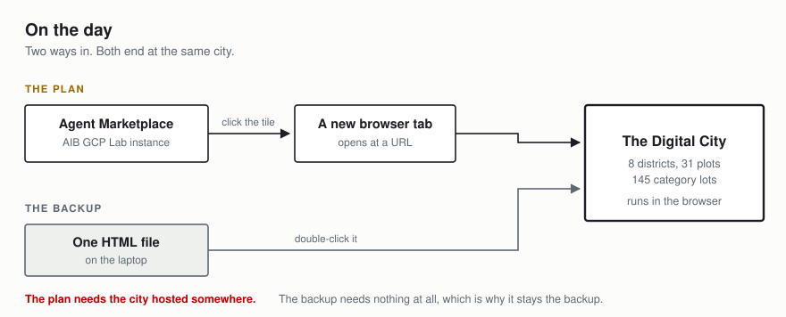
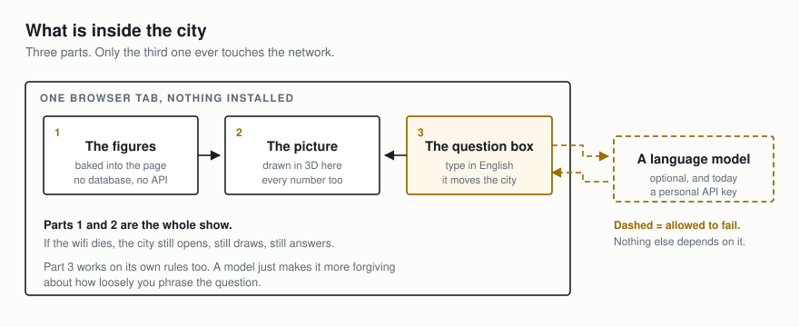
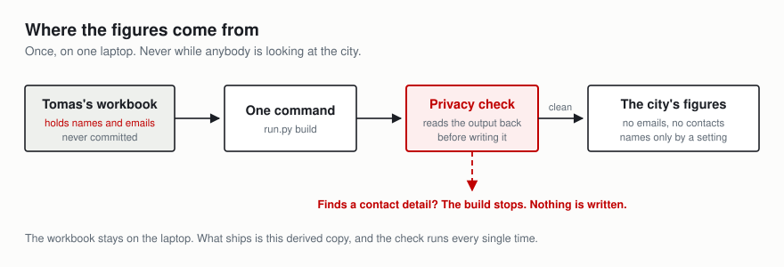
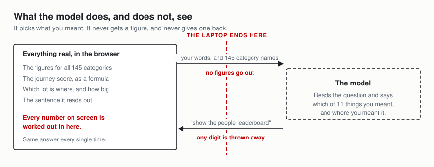

# Architecture

Four pictures, plain English first, then the detail. The diagrams are committed
as images rather than diagram code, so they render in VS Code, on GitHub and
anywhere else without an extension.

For why each choice was made rather than what it is, see [DESIGN.md](DESIGN.md).

---

## 1. On the day



The all-hands route starts in the Agent Marketplace on the AIB GCP Lab
instance. The Digital City is one agent in it. Clicking that tile opens a new
browser tab, and the city loads there.

**That route needs the city hosted at a URL.** A marketplace tile has nothing
to point at otherwise, so a deployment is not optional for the marketplace
path.

The backup route is the single HTML file on the laptop. Same city, same
figures, no network, no hosting. It exists because a live demo in front of 400
people should not have a single point of failure that belongs to somebody
else's infrastructure.

---

## 2. What is inside the city



Three parts, and it matters which is which.

**The figures are baked into the page.** There is no database and no API call
to fetch data. The whole extract is a JavaScript file the page loads, which is
why the city opens with the network unplugged.

**The picture is drawn in the browser.** All of it: the 145 lots, their sizes,
the buildings, the score, every number on screen. 3D through three.js, which
ships with the page rather than being fetched.

**The question box is the only part that ever reaches out**, and only when
there is something to reach. From a file there is nothing to ask, so it uses
its own rules. With the service running it asks for a routing decision and
falls back to those same rules if the answer is slow, unreachable or
unusable.

So the dashed box is the only thing in the system that can fail, and nothing
else depends on it.

---

## 3. Where the figures come from



This happens once, on one laptop, before anybody looks at anything. It is not
part of what runs on the day.

The workbook holds blueprint owner names and email addresses. It is
git-ignored, so it never becomes part of the repository. `run.py build` derives
the city's figures from it, and before writing anything the build reads its own
output back looking for contact details. If it finds one, it refuses to write
and says so.

Category manager names are in the output, and only because
`config/metrics.yaml` says `people: show: names`. Set that to `initials` or
`none`, rebuild, and they are gone. Nothing else changes.

---

## 4. What the model does, and does not, see



The model gets your question and the list of things the city contains: 145
category names, 8 districts, 31 plots, 21 markets. **It gets no figures at
all**, so no spend number leaves the laptop, and it has nothing to state even
if asked.

It returns one small object naming which of eleven intents your question was
and where it pointed:

```json
{"intent": "leaders", "view": "people"}
```

Three rules make that safe rather than merely tidy.

1. **No figures go up.** Names only.
2. **No figures come down.** Any digit in the model's framing text is stripped
   before anything is drawn. Every number on screen is computed in the browser.
3. **No invented targets.** A category the city does not hold is dropped and
   noted, so the camera cannot fly nowhere and print a code that does not
   exist.

### Is this an agent?

Partly, and worth being precise about, because it is the first thing anyone
technical will ask.

**What is genuinely agentic:** it uses tools (eight of them), the chosen intent
selects which run, every call is printed to a visible trace panel as it
happens, and the output surface is the application state rather than text. It
answers by changing what you are looking at.

**What is not AI at all:** every number, the journey score, the layout, the
name resolver, and the fallback routing. All deterministic, all identical on
every run, all covered by tests.

**The honest description:** a constrained natural-language interface over a
deterministic visualisation, with a tool-calling loop and a visible trace. Not
an autonomous agent. No multi-step planning, no self-correction, no memory
between questions, and no ability to write or change any data. That is a
deliberate choice for something running live, not a gap to fill in later.

---

## The eight tools

The whole of what a question can cause to happen.

| Tool | What it does |
| --- | --- |
| `find_category` | Resolve a code, a name, a district, a plot, a market or a definition |
| `get_metrics` | Every measure held for one category |
| `measure` | The value a ranking sorts on, including the journey score |
| `rank` | Categories in a scope, ordered by a metric |
| `leaders` | Open the leaderboard on one of its three views, return the rows |
| `find_gaps` | Lots with money on them and nothing built |
| `summarise` | Built, empty and spend for a scope |
| `render` | Drive the city: fly, focus, dim, raise, speak |

`render` is the important one. The visualisation is the agent's output surface.

## One question, two routes

| | Routed by | When |
| --- | --- | --- |
| **Served** | the model, validated | the service is up and answers in time |
| **From a file** | regular expressions in `agent.js` | always, because there is nothing to ask |
| **Served but degraded** | the same regular expressions | slow, unreachable, or an unusable answer |

The fallback is not an error path, it is the default path. Both routes end at
the same tool call, and the browser suite drives both, because two sets of
rules answering one question differently is a failure nobody notices until it
is live.

---

## The renderer

| Drawn from | Into |
| --- | --- |
| `city-data.js` | the layout: districts, plots, 145 lots, their sizes |
| the layout | instance buckets: bricks, windows, roads, kerbs, trees, houses, hotels |
| the layout | five landmarks, one per blueprint that reached five or more markets |
| the layout | the builder, a minifigure, drawn on its own camera layer |
| `city-data.js` | the arc rail, the journey panel's three views, the legend |


Two things here are worth knowing before reading the code:

**Everything is `InstancedMesh`.** One draw call per shape, so 145 buildings of
up to sixteen storeys stay at a steady frame rate on a laptop with no discrete
graphics. Building a category rewrites instance matrices on a wall-clock
timeline rather than adding objects.

**The builder is drawn in a second pass on camera layer 1**, after
`renderer.clearDepth()`, so a minifigure standing behind a tower is still
visible. The sky is `renderer.setClearColor()` rather than `scene.background`
for the same reason.

**The legend is generated from `config/metrics.yaml`.** Change which metric
drives a layer and the on-screen explanation follows, so the explanation cannot
drift from what is drawn.

## Configuration is the pivot point

```yaml
layers:
  height:
    metric: market_reach     # swap to ava_adoption, cbp_total, spend_eur
```

`city.json` carries *every* candidate metric for every category, so changing
the business lens is an edit to one line. No rebuild, no code change. Tests
fail if a layer points at a metric the data does not carry, and a separate test
refuses any metric the registry marks as not-real from driving anything
visible.

The same file declares the score weights, the spend bands, the landmark rules,
the minimum categories for the leaderboard, and whether people are shown by
name, by initials or not at all.

## Privacy, as enforced rather than intended

The source workbook carries blueprint owner names and email addresses. Four
independent mechanisms, because one is a promise and four is a property.

| Mechanism | What it stops |
| --- | --- |
| `data/raw/` is git-ignored | the workbook ever becoming a tracked file |
| the build reads its own output back before writing | a contact detail, or a name the config forbids, reaching `city.json` |
| the packager works from a named list, never a directory walk | a workbook ending up inside a zip somebody emails |
| 27 security assertions scan every tracked file | a credential, a contact detail or the workbook itself surviving a commit |

Category manager names are published, and only because
`config/metrics.yaml` says `people: show: names`. Setting it to `initials` or
`none` and rebuilding is the whole change; nothing else moves.

## The model ladder

A single model name in a config file is a single point of failure on the day,
so `NW_MODEL` is a first choice rather than an instruction.

| Setting | Role |
| --- | --- |
| `NW_MODEL` | first choice, not an instruction |
| `NW_MODELS` | the ladder to fall down |
| `NW_PIN=1` | refuse to move off the first choice |
| mock | the last rung, which always answers |

| What happened | What the ladder does |
| --- | --- |
| 404, the model is gone | rests it for 24 hours, moves on |
| 429 or 503 | rests it for whatever it asks for, or an hour |


A model that returns 404 is rested for a day; one that rate-limits is rested
for whatever it asks for, or an hour. The answer reports which model actually
replied, not which one was configured, because a result you cannot attribute to
a model is not much of a result.

## Testing topology

| Stage | What it drives |
| --- | --- |
| 1 | 127 Python assertions: the data, the figures the documents quote, the plan parser, the model ladder, the service, and 27 security checks |
| 2 | 41 questions routed end to end |
| 3 | a real browser against the file, then again at phone size |
| 4 | a real browser against the running service, then again at phone size |
| 5 | a real browser against the inlined single file, then again at phone size |

Ordered cheapest first, so a broken build is reported in under a second rather
than after two minutes of browser work. `run.py test` is the whole thing, and
it ends with one verdict naming whatever failed.

Stage 5 exists because inlining is a text substitution and text substitutions
go wrong quietly: a broken single file looks exactly like a working one until
somebody opens it, and by then it is in their inbox.

## Deployment

| Step | Detail |
| --- | --- |
| what gets uploaded | the repository minus everything `.gcloudignore` excludes, `data/raw/` first among them |
| what builds it | Cloud Build, into a container image |
| what runs it | Cloud Run |
| how it authenticates | a service account, so no key is in the image or the environment |
| what it calls | Vertex AI, with `NW_PROVIDER=vertex` |

The deploy script refuses to upload without a committed `.gcloudignore`,
because Cloud Build uploads a folder and the workbook lives in one.

## What each file is for

```
run.py                    the only command anyone needs
config/metrics.yaml       which metric drives which visual layer
data/build_city.py        workbook to anonymised city.json
data/city.json            the only data the renderer needs
renderer/index.html       the shell, the panels, the styles
renderer/city.js          the city, the builder, the choreography
renderer/agent.js         the tools, the resolver, the visible trace
renderer/city-data.js     city.json as a global, because file:// blocks fetch
renderer/vendor/          three.js r134 UMD, vendored on purpose
app/server.py             serves the page and holds the credential
app/plan.py               what the model may decide, and the validation
app/providers.py          mock, Gemini, Vertex, Claude behind one interface
app/models.py             asks a provider what it actually has
app/eval.py               the question set, run end to end
app/env.py                reads .env without a dependency
tests/test_docs.py        every figure the documents quote
tests/test_security.py    secrets, personal data, what gets distributed
tests/smoke.js            a real browser, desktop and phone
deploy/cloudrun.sh        Cloud Run with a service account, no key
```

## Decisions that are hard to reverse

Worth knowing before changing anything.

**three.js r134 UMD, vendored.** `file://` blocks ES modules and `fetch()`, so
a module build and a CDN are both unavailable. This is why data ships as a
script assigning a global rather than as JSON.

**`city.json` carries every candidate metric, not just the bound ones.**
It is what makes the config a pivot point rather than a comment.

**The renderer has no runtime dependency on the service.** Any feature that
only works when the service is up is a feature that will not work on stage.

**The score is computed in two places.** Python for the build, JavaScript for
the panel roll-up, with the same sqrt-of-spend weighting. A single test asserts
they agree, because two implementations of one formula is a real risk and the
alternative was shipping pre-computed rollups for combinations nobody asked for
yet.
